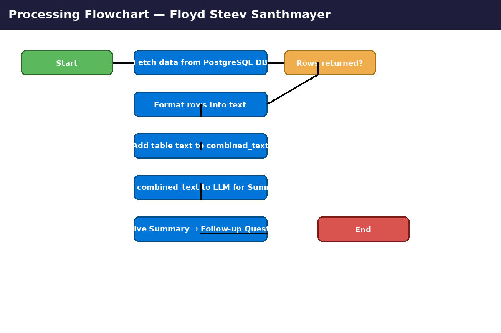

# Data Summarizer & Flow — Floyd Steev Santhmayer

**Professional project scaffold** for summarizing tabular data, generating concise LLM-driven summaries and follow-up questions, and visualizing the processing flow.

---

## Overview

This repository contains a production-ready scaffold for a data summarization pipeline that:

- Connects to PostgreSQL to fetch small slices of CSV-imported tables.
- Concatenates and pre-processes rows into text payloads.
- Sends text to a configured LLM endpoint (OpenRouter/OpenAI-compatible) for **concise summaries** and **follow-up question generation**.
- Provides a Streamlit-based launcher for exploration and demoing.
- Includes CI, pre-commit hooks, tests, licensing, and containerization.

## Contents
- `app.py` — Streamlit launcher and quick demo UI.
- `flowchart_colored.mmd` — Mermaid source for the flowchart (color-coded).
- `architecture.mmd` — Mermaid architecture diagram for reviewers.
- `docs/flowchart_colored.png` — Rendered flowchart image (color-coded).
- `Dockerfile`, `requirements.txt`, `.env.example`, `.gitignore` — deployment & environment.
- `.github/workflows/ci.yml`, `.github/dependabot.yml`, `.pre-commit-config.yaml` — CI and automation.
- `tests/` — pytest scaffold with a basic smoke test.
- `FLOWCHART_DETAILED.md` — Detailed, step-by-step explanation for technical reviewers.
- `CONTRIBUTING.md` — Contribution guidelines.
- `LICENSE` — MIT license with copyright holder **Floyd Steev Santhmayer**.

## Flowchart (quick view)


> The image above is a color-coded representation of the pipeline. Use `flowchart_colored.mmd` to iterate on the Mermaid source.

## Quickstart (local)

1. Copy `.env.example` to `.env` and populate your DB and API credentials.
2. Create a Python virtual environment and install dependencies:
   ```bash
   python -m venv .venv
   source .venv/bin/activate
   pip install -r requirements.txt
   ```
3. Run Streamlit:
   ```bash
   streamlit run app.py
   ```
4. For containerized runs:
   ```bash
   docker build -t floyd-summarizer:latest .
   docker run --env-file .env -p 8501:8501 floyd-summarizer:latest
   ```

## CI & Quality
- Pre-commit hooks are configured to run formatting and simple static checks.
- GitHub Actions runs tests and linters on push/PRs.

## License
This project is released under the MIT License — see `LICENSE` for details (copyright: Floyd Steev Santhmayer).

## Contact
For major changes or questions, open an issue or contact the maintainer listed in `CONTRIBUTING.md`.
